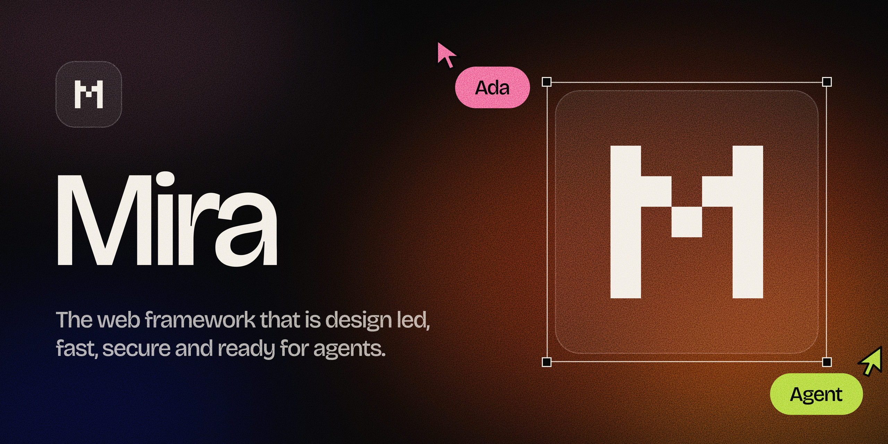

<p align="center"></p>

<p align="center">
  <a href="https://github.com/buildwithmira/mira/actions/workflows/ci.yml"></a>
  <a href="https://www.npmjs.com/package/@miraframework/mira"></a>
  <a href="#license"></a>
</p>

Mira turns Markdown and `.mira` templates into plain HTML files. Pages work without JavaScript. When the browser supports it, navigation between pages uses native View Transitions, so a site can move like an app while staying a set of static files.

```bash
npm create mira@latest my-site
cd my-site
npm install
npm run dev
```

## Features

- **Static output.** Every page is an `index.html` with its CSS inlined. The optional runtime is about 1 KB gzipped, and the build fails if it ever exceeds 2 KB.
- **Page transitions.** Cross-document View Transitions with shared elements (`mira-morph`), per-route transition pairs, direction awareness, and reduced-motion support. Links are prefetched or prerendered with Speculation Rules.
- **Content collections.** Markdown and MDX entries in `content/`, or items from Sanity, Contentful, Supabase, any GraphQL API, or any JSON endpoint, all checked against typed schemas on every build.
- **Templates.** `.mira` files with `{{ }}` expressions, `{#if}`, `{#each}`, layouts, and slots. Output is escaped by default. MDX files use `.mira` components, rendered at build time.
- **Media.** `<mira-frame>` reserves space for each image, encodes AVIF, and draws an 8×8 placeholder inline until the image loads.
- **Search.** A search index is written at build time and loaded only by pages that use search.
- **Security.** A strict Content Security Policy with a hash for every inline script and style, plus security headers for every supported host.
- **Agents.** Each page has a Markdown version, plus `llms.txt` with page sizes, a sitemap, RSS feeds, and JSON-LD. Every site can be read over MCP, and can declare actions, such as booking a table, that agents take with the person's agreement. `mira build --json` reports results and errors as JSON.
- **Hosting.** Writes native config for Vercel, Netlify, Cloudflare Pages, GitHub Pages, Firebase, Render, Azure Static Web Apps, AWS Amplify, S3 with CloudFront, Deno Deploy, and Docker (nginx), which runs on Cloud Run, App Runner, and Azure Container Apps.
- **Migration.** `mira migrate` imports Next.js, Astro, Hugo, Jekyll, Docusaurus, Gatsby, Eleventy, and VitePress sites, and writes redirects for every URL that changes.

The starter site builds in about 20 ms, with pages between 5 and 7 KB gzipped.

## Install

Mira is pre-release. It ships as a single native binary for Linux (x64, arm64), macOS (Apple silicon, Intel), and Windows (x64, arm64).

**npm.** Installs the binary for your platform. Node.js 18 or later.

```bash
npm install --save-dev @miraframework/mira
```

**Prebuilt binaries.** Attached to each [release](https://github.com/buildwithmira/mira/releases), with SHA-256 checksums.

**From source.** Requires [Rust](https://rustup.rs).

```bash
cargo install --git https://github.com/buildwithmira/mira mira
```

## Commands

| Command | What it does |
| --- | --- |
| `mira new <dir>` | Create a site from the starter template |
| `mira dev` | Serve the site on `localhost:4321`, rebuilding and reloading on change |
| `mira build` | Build the site to `dist/` |
| `mira migrate <from> <to>` | Move an existing site into a new Mira project |
| `mira mcp` | Serve the site's content over MCP on standard input and output |

Run `mira <command> --help` for options.

## Use with MCP

Every Mira site can be read over the [Model Context Protocol](https://modelcontextprotocol.io): its pages as Markdown, search, each collection's entries with typed fields, data files, and media.

Point an MCP client at any deployed Mira site, on any host:

```json
{
  "mcpServers": {
    "my-site": {
      "command": "npx",
      "args": ["-y", "@miraframework/mira", "mcp", "--url", "https://example.com"]
    }
  }
}
```

Or at a project on disk, rebuilt when its files change: use `"--root", "/path/to/my-site"` in place of `"--url"`. Both answer the same way, because every build publishes what the server reads: a Markdown copy of each page, the search index, and a content index under `/_mira/`.

| Tool | What it returns |
| --- | --- |
| `site` | The site's title and URL, and every collection, with field types, and data file |
| `pages` | One line per page: path, title, and description |
| `search` | The best matches, each pointing at the section that matches |
| `read` | A page as Markdown, or one section of it with `path#section` |
| `items` | A collection's entries, filtered and sorted by field: `{"price": {"lt": 20}}` |
| `data` | A data file, or one value in it, as JSON |
| `media` | Images and video with alt text, captions, and sizes |

Sites can also declare [actions](https://mira.omrajguru.site/docs/actions/), such as booking a table, with typed input and an endpoint of your choice. Each becomes a tool, and Mira sends nothing until the person using the agent agrees.

Answers are sized for agents: search returns five short matches, `read` can return a single section, and `items` filters before anything is sent. `mira audit --agent` reports what each page costs an agent to read.

`--url` accepts `https://` addresses only, follows no redirects, and reads nothing outside the site.

## Agent skills

Two skills teach coding agents to work with Mira. Each includes the full docs as reference files.

```bash
npx skills add buildwithmira/mira
```

| Skill | For |
| --- | --- |
| `mira` | Building, editing, checking, and deploying Mira sites, and reading them over MCP |
| `mira-migrate` | Moving a site from another framework and finishing what `mira migrate` lists for review |

Install one with `--skill mira` or `--skill mira-migrate`.

## Project layout

```text
my-site/
├── mira.config.json     site settings, collections, hosts, redirects
├── routes/              pages: index.mira, about.md, posts/[slug].mira
├── layouts/             default.mira wraps every page
├── content/             collections of Markdown entries
└── public/              copied to the output as is
```

## Deploy

`mira build` writes a complete static site to `dist/`. Name your hosts in `mira.config.json`, and each build also writes those hosts' own config files, so headers, clean URLs, the 404 page, and redirects work the same everywhere:

```json
{
  "site": { "url": "https://example.com" },
  "hosts": { "vercel": {}, "netlify": {} },
  "redirects": { "/old-path/": "/new-path/" }
}
```

Supported hosts: `vercel`, `netlify`, `cloudflare`, `github`, `firebase`, `render`, `azure`, `docker`, `deno`, and `s3`. Any other static host works by uploading `dist/`.

## Repository

| Path | Contents |
| --- | --- |
| `crates/mira_compiler` | The compiler library: config, routing, templates, Markdown, media, outputs, and host adapters |
| `crates/mira_cli` | The `mira` binary: commands, dev server, MCP server, terminal output |
| `crates/mira_compiler/runtime` | The client runtime and base CSS embedded in every build |
| `crates/mira_compiler/starter` | The template used by `mira new` |
| `skills/` | Agent skills, installable with `npx skills add buildwithmira/mira` |
| `npm/` | The npm packages: `@miraframework/mira`, its per-platform binaries, and `create-mira` |
| `tools/check_host.py` | Checks a deployed site's status codes, headers, and content types |

## Contributing

See [CONTRIBUTING.md](CONTRIBUTING.md). To report a security issue, follow [SECURITY.md](SECURITY.md) and do not open a public issue.

## License

Licensed under either of [Apache License, Version 2.0](LICENSE-APACHE) or [MIT license](LICENSE-MIT), at your option.

Unless you explicitly state otherwise, any contribution intentionally submitted for inclusion in Mira by you, as defined in the Apache-2.0 license, shall be dual licensed as above, without any additional terms or conditions.
